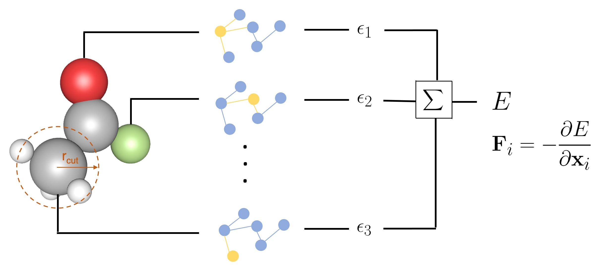

# E(3) Equivariant Energy-Based-Model



## Description
This repository contains an euclidean equivariant model in order to predit the energy landscape and interaction force field of the Dipole Dataset. The prediction is done performing some unsupervised learning with Implicit Score Matching model. Our aim is to move this model farward in order to learn the interaction force field between ligand and protein in PDBbind dataset.

## Prerequisites
* Anaconda or miniconda with Python 3.9
* PyTorch version 1.12.1
* e3nn library version 0.5.0
* torch_geometric version 2.1.0

## Usage
To train the model run this command on your shell:
```
python dipoles.py [-h] [--layers LAYERS] [--lmax LMAX] --mul MUL --lr LR --cutoff CUTOFF --batchsize BATCHSIZE --numepochs NUMEPOCHS
                  [--gamma GAMMA] [--seed SEED] --clip_norm CLIP_NORM --clip_value CLIP_VALUE --optim OPTIM --wd WD [--edit | --no-edit]
                  [--use_percent | --no-use_percent] --percent PERCENT [--all_in_batch | --no-all_in_batch] [--wandb | --no-wandb]
                  --save_model SAVE_MODEL --patience PATIENCE --cooldown COOLDOWN
```
The `jobscript` file is uploaded to run the model on C3SE chalmers Alvis cluster via the command:
```
sbatch jobscript
```

### Training visualization
In order to have some training visualization via W&B just set the `--wandb` flag and change the API_KEY at line 138 of `dipoles.py` file.


## Simulations
In that directory you can find a code to simulate the potential learned from the model. To run the code run:
```
python dipoles.py [-h] --tau TAU --Tmax TMAX [--D D] [--K_BT K_BT] --model_path MODEL_PATH [--stride STRIDE]
```
where a learned model at `model_path` is required. The code outputs a .npy file to draw a probability 2D histogram and a .xyz file to have a look at the trajectory with VMD.
